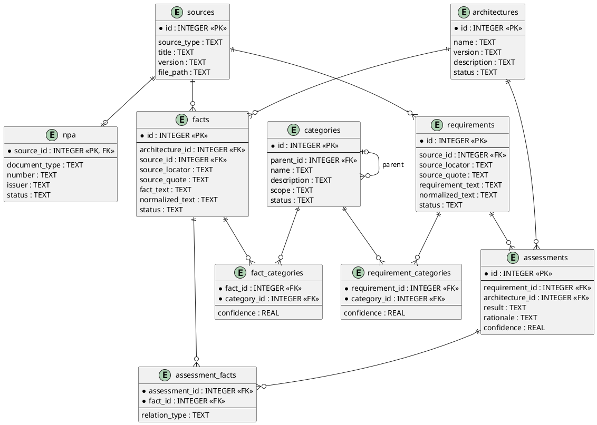

# Architecture MCP — инструкция по разработке

## 1. Функциональные требования

MCP должен:

* работать как локальный MCP-сервер для Goose и использовать SQLite;
* получать путь к SQLite из конфигурации/переменной окружения;
* автоматически создавать БД и её схему при первом запуске;
* хранить источники данных, включая НПА, ТЗ и архитектурные документы;
* хранить атомарные требования: одна запись = одно требование;
* хранить атомарные архитектурные факты: одна запись = один проверяемый факт;
* связывать факты с конкретной архитектурой;
* использовать единый справочник категорий для требований и фактов;
* поддерживать M:N-связи:

  * `requirement ↔ category`;
  * `fact ↔ category`;
* позволять агенту получать существующие категории перед классификацией;
* позволять создавать новую категорию, если после анализа существующих подходящая категория отсутствует;
* хранить происхождение требований и фактов: источник, положение в источнике и исходную цитату;
* поддерживать поиск и получение требований, фактов, источников и категорий;
* позволять создавать оценку соответствия требования конкретной архитектуре;
* позволять связывать оценку с фактами, которые:

  * подтверждают требование;
  * противоречат ему;
  * дают дополнительный контекст;
* поддерживать результат `INSUFFICIENT_DATA`, если данных недостаточно для вывода;
* предоставлять все операции через предметные MCP tools.

---

## 2. Нефункциональные требования

* AI-агент не должен иметь прямого доступа к SQLite.
* AI-агент работает только через MCP tools.
* Не создавать tool вида `execute_sql()` с произвольной записью в БД.
* SQL должен находиться внутри модулей MCP и использовать parameterized queries.
* Составные операции записи должны выполняться транзакционно.
* MCP не должен загружать всю БД или большие документы в оперативную память.
* Операции получения списков должны иметь `limit` и при необходимости `offset`.
* Обработка данных должна преимущественно выполняться потоково или небольшими выборками.
* Целевая утилизация памяти MCP в обычном режиме — до **128 МБ RSS**.
* Утилизация более **256 МБ RSS** без выполнения явно большой операции считается архитектурной проблемой и требует устранения.
* Не использовать ORM, векторные БД, Redis и другие тяжёлые зависимости без отдельной необходимости.
* Проект должен оставаться небольшим и помещаться вместе с основной документацией в контекст около 48K токенов.

---

## 3. Структура проекта

```text
src/
└── architecture_mcp/
    ├── server.py
    ├── db.py
    ├── models.py
    ├── sources.py
    ├── requirements.py
    ├── facts.py
    ├── categories.py
    └── assessments.py

tests/
└── test_mcp.py

pyproject.toml
README.md
AGENTS.md
```

### `server.py`

**Composition Root** приложения.

Отвечает только за:

* создание MCP-сервера;
* создание подключения/объекта БД;
* подключение модулей через их `register()`;
* запуск MCP.

Пример:

```python
mcp = MCPServer("architecture-mcp")
db = Database(...)

sources.register(mcp, db)
requirements.register(mcp, db)
facts.register(mcp, db)
categories.register(mcp, db)
assessments.register(mcp, db)
```

В `server.py` не размещать SQL и предметную бизнес-логику.

### `db.py`

Общий инфраструктурный слой SQLite:

* открытие соединения;
* создание схемы;
* миграции схемы;
* транзакции;
* `PRAGMA`;
* базовые вспомогательные функции работы с SQLite.

### `models.py`

Только общие структуры:

* Enum;
* dataclass/Pydantic-модели при необходимости;
* общие типы результатов.

Не превращать файл в универсальный склад вспомогательного кода.

### `sources.py`

Работа с:

* источниками;
* НПА;
* архитектурами;
* сведениями о происхождении данных.

### `requirements.py`

Работа с требованиями:

* создание;
* изменение;
* получение;
* поиск;
* привязка к источнику;
* предметные MCP tools требований.

### `facts.py`

Работа с архитектурными фактами:

* создание;
* изменение;
* получение;
* поиск;
* привязка к архитектуре и источнику;
* предметные MCP tools фактов.

### `categories.py`

Работа с:

* категориями;
* поиском существующих категорий;
* созданием новых категорий;
* назначением категорий требованиям и фактам;
* иерархией категорий, если она необходима.

### `assessments.py`

Работа с проверкой соответствия:

* создание assessment;
* результат проверки;
* rationale;
* связь requirement ↔ architecture;
* связь assessment ↔ facts;
* `SUPPORTS / CONTRADICTS / CONTEXT`.

---

## 4. Диаграмма последовательности

```plantuml
@startuml

actor Goose
participant "server.py
Composition Root" as Server
participant "Domain Module
register() + functions" as Module
participant "db.py" as DB
database SQLite

Goose -> Server : MCP tool call
Server -> Module : registered handler

Module -> Module : validation / business rules
Module -> DB : data operation

DB -> SQLite : parameterized SQL
SQLite --> DB : result
DB --> Module : structured data

Module --> Server : structured result
Server --> Goose : MCP response

@enduml
```

---

## 5. Модель данных и связи таблиц

База данных должна оставаться компактной.

Основные сущности:

* `sources` — источники информации;
* `npa` — дополнительные реквизиты источников типа НПА;
* `architectures` — анализируемые архитектуры;
* `requirements` — атомарные требования;
* `facts` — атомарные архитектурные факты;
* `categories` — единый справочник категорий;
* `requirement_categories` — связь требований с категориями;
* `fact_categories` — связь фактов с категориями;
* `assessments` — результаты проверки требований относительно архитектуры;
* `assessment_facts` — факты, использованные в оценке.



### Ключевые правила модели

* `sources → requirements` — один источник может содержать множество требований.
* `sources → facts` — один источник может содержать множество фактов.
* `sources → npa` — запись `npa` является расширением источника типа НПА.
* `architectures → facts` — каждый факт относится к конкретной архитектуре.
* `requirements ↔ categories` — M:N через `requirement_categories`.
* `facts ↔ categories` — M:N через `fact_categories`.
* `categories.parent_id` обеспечивает простую иерархию категорий.
* `assessment` всегда относится одновременно к одному `requirement` и одной `architecture`.
* `assessment ↔ facts` — M:N через `assessment_facts`.
* `assessment_facts.relation_type` принимает значения:

  * `SUPPORTS`;
  * `CONTRADICTS`;
  * `CONTEXT`.
* составные пары в таблицах связей должны быть уникальными;
* внешние ключи должны контролироваться SQLite через `PRAGMA foreign_keys = ON`.

Схема является минимальной моделью первой версии. Новые таблицы не добавлять заранее «на будущее» без появления реальной функциональной необходимости.

---

## 6. Архитектурный стиль разработки

Использовать архитектурный стиль:

**Modular Monolith + Composition Root + Explicit Module Registration.**

### Основные правила

Каждая предметная область реализуется отдельным модулем:

```text
requirements.py
facts.py
categories.py
...
```

Модуль должен содержать небольшие атомарные функции:

```python
create(...)
get(...)
update(...)
search(...)
assign_category(...)
```

Функция должна выполнять одну понятную предметную операцию.

### Explicit Module Registration

Каждый MCP-модуль экспортирует:

```python
def register(mcp, db):
    ...
```

`register()` регистрирует MCP tools данного модуля.

Например:

```python
def register(mcp, db):

    @mcp.tool()
    def requirement_create(...):
        return create(db, ...)
```

Все модули подключаются централизованно только через `server.py`.

Таким образом:

```text
server.py
    ↓ register()
requirements.py
facts.py
categories.py
...
```

Это позволяет открыть `server.py` и сразу увидеть полный состав приложения.

### Dependency Injection

Зависимости передаются явно:

```python
register(mcp, db)
```

и:

```python
create(db, ...)
```

Не использовать глобальные подключения к БД внутри модулей без необходимости.

### Ограничение связности

Предметные модули не должны образовывать сеть взаимных импортов.

Предпочтительная зависимость:

```text
domain module
     ↓
   db.py
     ↓
 SQLite
```

Общие типы допускается импортировать из `models.py`.

Если два модуля начинают активно импортировать друг друга — архитектуру следует пересмотреть.

### Минимум абстракций

Не создавать отдельные:

```text
repository
service
manager
handler
controller
factory
```

если они только передают вызов следующему слою.

Предпочитать:

```text
MCP tool
   ↓
atomic domain function
   ↓
db.py / SQLite
```

### Размер файлов

Предпочитать небольшое количество содержательных файлов.

Новый файл создаётся только тогда, когда появляется самостоятельная предметная ответственность, а не ради формального разделения слоёв.

### Заголовок каждого файла

Каждый Python-файл должен начинаться с короткого **module-level docstring**, объясняющего назначение файла.

Например:

```python
"""
MCP tools and domain operations for architecture requirements.
"""
```

Не писать длинные архитектурные инструкции непосредственно в исходных файлах.

### Git как история действий агента

После каждого логически завершённого изменения агент должен создавать Git commit.

Принцип:

```text
одно законченное изменение
        ↓
проверка
        ↓
commit
        ↓
следующее изменение
```

Не накапливать большое количество независимых изменений в одном commit.

Предпочтительные сообщения:

```text
feat(requirements): add requirement creation
feat(categories): add category assignment
fix(db): rollback failed transaction
refactor(server): simplify module registration
test(facts): add fact creation tests
docs: update MCP tool description
```

Перед commit необходимо по возможности:

```bash
uv run pytest
uv run ruff check .
```

Git history рассматривается как журнал действий coding-агента и должна позволять понять последовательность изменений проекта.

---

## Главный принцип

При выборе между:

```text
новая архитектурная абстракция
```

и:

```text
простая функция в существующем предметном модуле
```

по умолчанию выбирать второй вариант.

Добавлять архитектурный слой следует только тогда, когда существующая структура действительно перестала справляться с задачей.

## ADR handling

Before starting work, inspect all files in `adr/` using `head` and read their `Status` field. Do not read every ADR in full by default. Read an ADR completely only when its status indicates active or pending implementation and it is relevant to the current task.

Supported ADR statuses:

* `PROPOSED` — решение предложено, но ещё не принято; do not implement unless explicitly requested.
* `ACCEPTED` — решение принято и ожидает реализации; read fully when relevant.
* `IN_PROGRESS` — реализация ADR выполняется; always read fully when relevant.
* `BLOCKED` — реализация начата, но заблокирована; read fully before related work.
* `COMPLETED` — ADR полностью реализован; normally only `head` is required unless historical context is needed.
* `REJECTED` — решение отклонено; do not implement.
* `SUPERSEDED` — ADR заменён другим ADR; follow the referenced replacement ADR instead.

ADR files must contain a `Status:` field near the beginning of the file so it is visible through `head`.

When starting implementation of an `ACCEPTED` ADR, the agent must change its status to:

```text
Status: IN_PROGRESS
```

When all requirements of the ADR are implemented and tests pass, the agent must change its status to:

```text
Status: COMPLETED
```

If implementation cannot be completed because of an external dependency, unresolved architectural decision, or blocking defect, set:

```text
Status: BLOCKED
```

Do not mark an ADR as `COMPLETED` until its required implementation and tests are finished. Status changes must be committed together with the corresponding implementation state.
