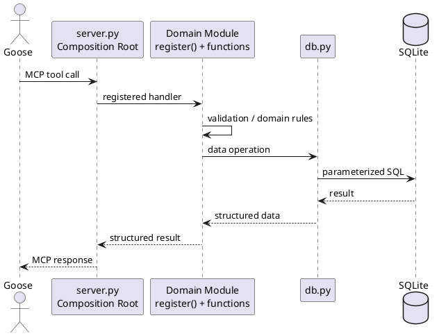
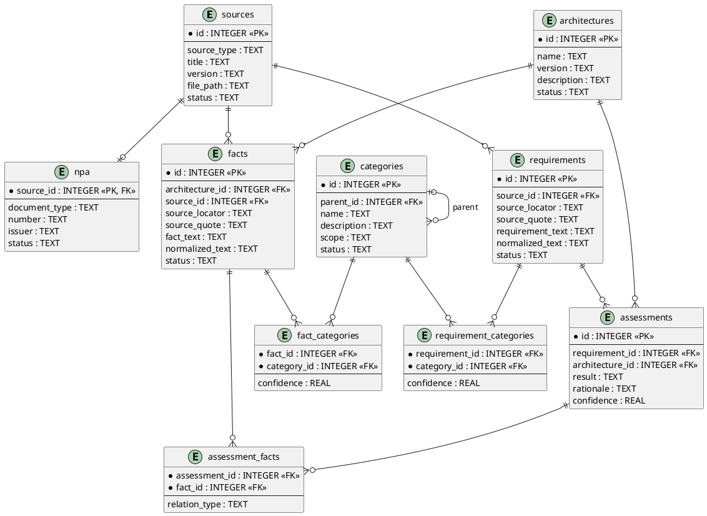

# Architecture MCP — Development Guide

This file defines the architecture and development rules for `architecture-mcp`.

Read it before changing the project.

## 1. Purpose

`architecture-mcp` is a local MCP server for Goose.

It stores structured knowledge used to verify software architecture against requirements from NPA, technical specifications, architecture documents, and other sources.

The server uses SQLite and exposes only domain-specific MCP tools.

Core capabilities:

* store source documents;
* store atomic requirements;
* store atomic architecture facts;
* bind facts to one architecture;
* classify requirements and facts with one shared category tree;
* preserve source, locator, and quote;
* search sources, requirements, facts, and categories;
* create assessments for a `(requirement, architecture)` pair;
* attach facts as `SUPPORTS`, `CONTRADICTS`, or `CONTEXT`;
* return `INSUFFICIENT_DATA` when evidence is insufficient;
* let the agent inspect existing categories before creating a new one.

One record must represent one requirement or one verifiable fact.

---

## 2. Hard Rules

1. AI must never access SQLite directly.
2. AI works only through MCP tools.
3. Never expose a generic `execute_sql()` tool.
4. SQL belongs inside domain modules.
5. Use parameterized SQL only.
6. Composite writes must be transactional.
7. List operations must use `limit` and, when useful, `offset`.
8. Process data in small batches. Do not load the full database or large documents into memory.
9. Normal memory usage should stay below **128 MB RSS**.
10. More than **256 MB RSS** without an explicitly large operation is an architecture defect.
11. Do not add ORM, vector databases, Redis, Kafka, or other heavy dependencies without a real functional need.
12. Keep source code and core documentation small enough to fit roughly within a 48K-token context.

---

## 3. Architecture

Use:

**Modular Monolith + Composition Root + Explicit Module Registration**

```text
src/architecture_mcp/
├── server.py
├── db.py
├── models.py
├── sources.py
├── requirements.py
├── facts.py
├── categories.py
└── assessments.py

tests/
adr/
pyproject.toml
README.md
AGENTS.md
```

Create a new module only for a real independent responsibility.

Do not split code only to create more layers.

### Runtime flow



Dependencies should normally follow:

```text
domain module
    ↓
db.py
    ↓
sqlite3
```

Shared types may come from `models.py`.

Avoid circular or dense cross-imports between domain modules.

---

## 4. Module Responsibilities

### `server.py`

Composition Root.

It may:

* create the MCP server;
* create the database object;
* register domain modules;
* start MCP.

It must not contain SQL or domain logic.

Example:

```python
mcp = MCPServer("architecture-mcp")
db = Database(...)

sources.register(mcp, db)
requirements.register(mcp, db)
facts.register(mcp, db)
categories.register(mcp, db)
assessments.register(mcp, db)
```

Opening `server.py` should make the full application composition clear.

### `db.py`

SQLite infrastructure:

* connection setup;
* schema creation;
* schema migrations;
* transactions;
* PRAGMAs;
* small SQLite helpers.

### `models.py`

Shared types only:

* enums;
* common result types;
* small shared models when needed.

Do not turn it into a generic utility module.

### `sources.py`

Owns:

* sources;
* NPA metadata;
* architectures;
* source provenance operations.

### `requirements.py`

Owns:

* requirement creation;
* update;
* lookup;
* search;
* source binding;
* requirement MCP tools.

### `facts.py`

Owns:

* fact creation;
* update;
* lookup;
* search;
* architecture binding;
* source binding;
* fact MCP tools.

### `categories.py`

Owns:

* category lookup;
* category search;
* category creation;
* hierarchy;
* assignment to requirements and facts.

The agent must inspect existing categories before creating a new one.

### `assessments.py`

Owns:

* assessment creation;
* result;
* rationale;
* confidence;
* requirement ↔ architecture relation;
* assessment ↔ fact relation;
* `SUPPORTS / CONTRADICTS / CONTEXT`.

---

## 5. Development Style

Keep domain functions small and explicit.

Prefer:

```python
create(...)
get(...)
update(...)
search(...)
assign_category(...)
```

Each function must perform one clear domain operation.

Pass dependencies explicitly:

```python
register(mcp, db)
create(db, ...)
```

Avoid global database connections.

Each MCP module exposes:

```python
def register(mcp, db):
    ...
```

MCP tools should be thin wrappers around domain functions.

Prefer:

```text
MCP tool
   ↓
atomic domain function
   ↓
db.py / SQLite
```

Do not add forwarding-only layers such as:

```text
repository
service
manager
handler
controller
factory
```

unless they solve a real architectural problem.

Every Python file must start with a short module-level docstring.

---

## 6. Data Model

The database should remain compact.

Core entities:

* `sources`;
* `npa`;
* `architectures`;
* `requirements`;
* `facts`;
* `categories`;
* `requirement_categories`;
* `fact_categories`;
* `assessments`;
* `assessment_facts`.



### Model invariants

* every requirement has a source;
* every fact belongs to one architecture;
* facts preserve source provenance;
* categories are shared by requirements and facts;
* category hierarchy uses `parent_id`;
* join-table pairs must be unique;
* every assessment belongs to exactly one requirement and one architecture;
* `assessment_facts.relation_type` is one of:

```text
SUPPORTS
CONTRADICTS
CONTEXT
```

Current assessment results are:

```text
COMPLIANT
INCOMPLIANT
PARTIAL
UNKNOWN
INSUFFICIENT_DATA
```

`PRAGMA foreign_keys = ON` is mandatory.

Do not add tables only for possible future use. Add them only when a functional requirement or accepted ADR requires them.

---

## 7. SQLite Rules

Use standard-library `sqlite3`.

Apply:

```text
foreign_keys = ON
journal_mode = WAL
synchronous = NORMAL
busy_timeout = 5000
```

Use:

```python
sqlite3.Row
```

for dict-friendly access.

All writes must use transactions:

```python
with db.transaction() as tx:
    ...
```

Commit on success. Roll back on failure.

The database path comes from:

```text
ARCH_MCP_DB
```

Use an absolute path and create the parent directory when needed.

Schema changes must use migrations.

Existing databases must not require recreation during normal upgrades.

Text search in v1 uses `LIKE`.

Do not add FTS or vector search without an accepted requirement or ADR.

Default list size:

```text
50
```

Maximum:

```text
500
```

---

## 8. Testing

Use:

```text
pytest
pytest-asyncio
```

Each domain module must test at least:

* one write;
* one read;
* important domain invariants.

Use a real temporary SQLite database.

Test MCP registration so expected tools appear through `mcp.list_tools()`.

Add a regression test for each bug fix when practical.

Before work is complete:

```bash
uv run pytest -q
uv run ruff check .
```

---

## 9. Git Discipline

Use Git as the coding agent's development history.

One logical change should produce one commit:

```text
change
  ↓
test
  ↓
commit
  ↓
next change
```

Do not combine unrelated work.

Prefer conventional commit messages:

```text
feat(requirements): add requirement creation
feat(categories): add category assignment
fix(db): rollback failed transaction
refactor(server): simplify registration
test(facts): cover fact creation
docs: update architecture rules
```

Do not force-push or rewrite shared history unless explicitly requested.

Keep the working tree clean between completed logical changes.

---

## 10. ADR Workflow

Architecture decisions are stored in:

```text
adr/
```

Before starting work, inspect the beginning of every ADR with `head` and read its `Status`.

Do not read all ADRs in full by default.

Read a relevant ADR completely when its status is:

```text
ACCEPTED
IN_PROGRESS
BLOCKED
```

Read other ADRs fully only when historical context is needed.

### ADR statuses

`PROPOSED`
Decision is under discussion. Do not implement unless explicitly requested.

`ACCEPTED`
Decision is approved and waiting for implementation.

`IN_PROGRESS`
Implementation has started.

`BLOCKED`
Implementation started but cannot continue because of a dependency, defect, or unresolved decision.

`COMPLETED`
Implementation and required tests are finished.

`REJECTED`
Decision was declined. Do not implement.

`SUPERSEDED`
Another ADR replaced this one. Follow the referenced ADR.

Every ADR must keep its `Status:` near the top so `head` can read it.

When implementation of an `ACCEPTED` ADR starts:

```text
Status: IN_PROGRESS
```

When all required implementation and tests are complete:

```text
Status: COMPLETED
```

If work cannot continue:

```text
Status: BLOCKED
```

Do not mark an ADR `COMPLETED` before its required code and tests are finished.

Commit ADR status changes together with the corresponding implementation state.

---

## 11. Explicit Non-Goals

Do not add these to v1 without a functional requirement or ADR:

* generic `execute_sql()`;
* authentication or multi-tenant isolation;
* FTS;
* embeddings or vector search;
* full database audit log;
* category aliases or synonyms;
* cross-architecture fact comparison;
* background workers or queues;
* REST or gRPC API;
* unnecessary architectural layers.

---

## 12. Default Design Rule

When choosing between:

```text
new architectural abstraction
```

and:

```text
simple function in an existing domain module
```

choose the simple function by default.

Add a new architectural layer only when the current structure can no longer handle the requirement clearly.
